# Recursive Companion 🔄

## A Meta-Framework for Self-Improving AI Agents

Recursive Companion implements a **three-phase iterative refinement architecture** where AI agents critique and improve their own outputs. Unlike single-pass systems, each agent automatically tracks its full revision history, making every decision inspectable and debuggable.



→ See the [Architecture Documentation](docs/RC_architecture.md) for detailed system design.

### Why Recursive Companion?

**See inside your AI's thinking.*** While other frameworks show you what happened, RC shows you why. Every agent maintains a complete audit trail of its critique-revision cycles, stopping conditions, and decision rationale. This transparency is built-in, not bolted on.

*Unlike single-shot responses, agents systematically refine their outputs by critiquing and improving their own work—thinking about their thinking.

**Flexible template loading.** The `build_templates()` utility lets you compose analytical patterns: override just what changes (usually only initial_sys), apply protocols to specific phases (usually throughout system templates for consistent behavior), or skip protocols entirely. System templates define WHO the agent is, user templates define WHAT task to perform, and protocols shape HOW to analyze—each layer independently configurable.


---

## 📚 Three Levels of Understanding

### Level 1: Just Use It (5 minutes)
```python
from recursive_companion import MarketingCompanion

agent = MarketingCompanion("gpt-4o-mini")
answer = agent("Why did engagement drop 30%?")
# Done. The agent critiques itself, refines, and converges.

# note: answer = agent("Why did engagement drop 30%?") gives same results as
#       answer = agent.loop("Why did engagement drop 30%?") 

# this means any Companion can now slot into different tooling frameworks  
# because of the  __call__ alias
```

### Level 2: Compose & Customize (30 minutes)
```python
# Pick your domain, tweak your parameters
marketing = MarketingCompanion(temperature=0.8, max_loops=2)
engineering = BugTriageCompanion(similarity_threshold=0.95)

# Orchestrate multi-agent workflows
synthesis = StrategyCompanion()
plan = synthesis(f"{marketing(problem)} + {engineering(problem)}")

# Or plug into LangGraph with zero changes
from langchain.runnables import RunnableLambda
marketing_node = RunnableLambda(marketing)  # It's a Runnable!
```
### Level 3: Extend the Framework (2 hours)

```python
# Create new domains by overriding one template
LEGAL_TEMPLATES = build_templates(initial_sys="legal_initial_sys")
class LegalCompanion(BaseCompanion):
    TEMPLATES = LEGAL_TEMPLATES
    SIM_THRESHOLD = 0.99  # Legal requires higher precision
```
## 🚀 Quick Start & Full Streamlit App

### Install
```bash
pip install -e .  # or pip install . for non-editable

export OPENAI_API_KEY="sk-..." # in terminal
# For Jupyter/Python (more secure):
# Create .env file with:
# OPENAI_API_KEY="sk-..."
# Then in your code:
# from dotenv import load_dotenv
# load_dotenv()
```

### Run the Complete Streamlit Application
```bash
streamlit run streamlit_app.py
```

**You get a full interactive application:**
- Select any companion type from the dropdown
- Enter your prompt and watch the AI refine its response
- See critique-revision cycles happen in real-time
- View cosine similarity scores update live
- Export results with one click

This isn't a demo - it's a production-ready application included with the framework!

### Other Examples
```bash
# Minimal example
python demos/quick_setup.py

# Multi-agent orchestration
python multi_agent_demos/multi_agent_demo_raw_rc.py

# LangGraph integration
python multi_agent_demos/multi_agent_langgraph_demo.py
```
---

## 🏗️ Architecture: Clean Layers, Clear Purpose
→ See the [Architecture Documentation](docs/RC_architecture.md)

```text
Your Code
    ↓ imports
recursive_companion/        # Pick your companion
    ├── base.py             # Standard: Marketing, Bug, Strategy, Generic
    └── streamlit.py        # Same companions + live UI updates
        ↓ inherits
core/chains.py              # The engine: 3-phase loop, convergence, history
        ↓ uses
templates/*.txt             # Hot-swappable prompts + protocol injection
```
**Where to Look (Separation of Concerns):**

- **Engineers** → core/chains.py (the mathematics of convergence)
- **Users** → recursive_companion/base.py (picking companions)
- **Prompt Engineers** → templates/ + template_load_utils.py
- **UI Developers** → streamlit.py (progress containers)

### Why This Architecture Matters

1. **Mathematical Convergence > Arbitrary Limits**
    - Not "stop after 3 tries"
    - Stop when `cosine_from_embeddings(revision[n-1], revision[n]) > 0.98`
2. **Companions as Callables = Composability**
- Works in Jupyter: `agent("question")`
- Works in LangGraph: `RunnableLambda(agent)`
- Works in Streamlit: Live visualization of critique-revision cycles!
3. **Templates as Data = Evolution Without Refactoring**
- Change prompts in production
- A/B test different protocols
- Domain experts can contribute without coding

### Multi-Agent Orchestration

#### **Raw Python** (Sequential):
```python
# multi_agent_demo_raw_rc.py
mkt_view = mkt.loop(problem)
bug_view = bug.loop(problem)
action_plan = synth.loop(combined_views)
```
#### **LangGraph** (DAG with parallelism):
```python
# multi_agent_langgraph_demo.py

graph = StateGraph()
graph.add_edges(
    ("marketing", "merge"),
    ("engineering", "merge"),
    ("merge", "strategy")
)
# Companions need ZERO changes to work as graph nodes!
```
---
## 🔧 Production Features

#### Observability

- **Verbose mode**: See every phase of thinking
- **Transcript capture**: Full run_log for debugging
- **Standard logging**: Integration-ready

### Efficiency

- **Token optimization**: No system prompt in history
- **Smart caching**: Single embeddings client
- **Early exit**: Stop when converged, not exhausted

### Flexibility

- **Any OpenAI model**: "gpt-4o-mini", "gpt-4", custom endpoints
- **Configurable everything**: Per-instance overrides
- **Template hot-reload:** Change prompts without code

---
## 🚀 Quick Start & Full Streamlit App

### Install
```bash
pip install -e .  # or pip install . for non-editable
export OPENAI_API_KEY=sk-...

# For Jupyter/Python (more secure):
# Create .env file with:
# OPENAI_API_KEY=sk-...
# Then in your code:
# from dotenv import load_dotenv
# load_dotenv()
```

### Run the Complete Streamlit Application
```bash
streamlit run streamlit_app.py
```

**You get a full interactive application:**
- Select any companion type from the dropdown
- Enter your prompt and watch the AI refine its response
- See critique-revision cycles happen in real-time
- View cosine similarity scores update live
- Export results with one click

This isn't a demo - it's a production-ready application included with the framework!

### Other Examples
```bash
# Minimal example
python demos/quick_setup.py

# Multi-agent orchestration
python multi_agent_demos/multi_agent_demo_raw_rc.py

# LangGraph integration
python multi_agent_demos/multi_agent_langgraph_demo.py
```
---
## 📝 Creating Your Own Companion

### 1. Write your
```text
# templates/financial_initial_sys.txt
{context}  # Protocol automatically injected

You are a Financial Analysis Companion. Focus on:
- Cash flow patterns and anomalies
- Risk indicators and market conditions
- Regulatory compliance implications
```

### 2. Create the companion class
```python
your_app/companions.py
from recursive_companion import BaseCompanion
from recursive_companion.template_load_utils import build_templates

class FinancialCompanion(BaseCompanion):
    TEMPLATES = build_templates(initial_sys="financial_initial_sys")
    MAX_LOOPS = 4  # Financial analysis needs thoroughness
    TEMPERATURE = 0.3  # Lower temperature for numerical precision
```

### 3. Use it anywhere
```python
fin = FinancialCompanion()

# note: callable - __call__ is an alias for loop()
analysis = fin("Q3 revenue variance exceeds 2 standard deviations") 
```
---
## 🎓 The Strategic Decomposition Protocol

Read ```templates/protocol_context.txt``` to see the structured reasoning framework that guides agents through:

- Multi-layered problem analysis
- Iterative pattern recognition
- Systematic refinement cycles

This structured approach to recursive problem decomposition consistently outperforms single-pass analysis.

---
## 📊 Benchmarks & Examples

See multi_agent_demos/ for complete examples:

- Raw RC: Simple, sequential, readable
- LangGraph: Parallel, traceable, production-scale

Both use identical companion objects. No refactoring needed.

---
*Built on the principle that true understanding emerges through iteration, and that the best frameworks disappear into your code.*

**License**

MIT

**Contributing**

PRs welcome! See our ```CONTRIBUTING.md```.

Special interest in:
- New domain templates
- Alternative embedding models for similarity
- Convergence visualization tools

This README inteded overall intentions:

1. **Three-level structure** mirrors the codebase organization
2. **Technical depth** with actual code snippets and architecture
3. **Clear separation** of who should look where
4. **Production focus** with real implementation details
5. **Philosophy + Mathematics** showing it's not just prompts
6. **Clean examples** demonstrating the "companions as callables" pattern
7. **Practical guidance** for extending the framework
