# Recursive Companion 🔄

[](https://opensource.org/licenses/MIT)
[](CONTRIBUTING.md)

## A Meta-Framework for Self-Improving Agents

Recursive Companion implements a **three-phase iterative refinement architecture** where LLM agents (instances of Classes) critique and improve their own outputs. Unlike single-pass systems, each agent automatically tracks its full revision history, making every decision inspectable and debuggable.



→ See the [Architecture Documentation](docs/RC_architecture.md) for detailed system design.

### Why Recursive Companion?

**See inside the thinking.*** While other frameworks show you what happened, RC shows you why. Every instance maintains a complete audit trail of its critique-revision cycles, stopping conditions, and decision rationale. This transparency is built-in, not bolted on.

*Unlike single-shot responses, agents systematically refine their outputs by critiquing and improving their own work—thinking about their thinking.

**Flexible template loading.** The `build_templates()` utility lets you compose analytical patterns: override just what changes (usually only initial system template per domain), apply overarching protocols to specific phases (usually throughout system templates in all realted domains for consistent behavior), or skip protocols entirely. System templates define WHO the agent is, user templates define WHAT task to perform, and protocols shape HOW to analyze—each layer independently configurable.


---

## What Makes RC Unique

| Code Pattern | Why It Matters | Rare in OSS? |
|--------------|----------------|--------------|
| **`Draft\|LLM → Critique\|LLM → Revision\|LLM` chains built once** | Three-phase self-improvement is automatic - no manual wiring | ✓✓ |
| **One `protocol_context.txt` feeds all system prompts** | Change reasoning style everywhere with one edit | ✓ |
| **Templates live as `.txt` files on disk** | Git tracks prompt changes; hot-reload without restarting | ✓ |
| **New expert domain = inherit BaseCompanion + point to template** | Three lines of code gets you a complete agent | ✓✓ |
| **Every Companion instance  is itself an `agent()` or `RunnableLambda(agent)`** | Same object works standalone or in any framework | ✓ |
| **Built-in `run_log` tracks all iterations** | See why decisions were made without adding instrumentation | ✓✓ |

✓ = Uncommon in open source projects | ✓✓ = Very rare in open source projects

---
### 🔧 Quick Clone

```bash
# Create conda environment
conda create -n recursive-companion python=3.12 -y # (or python=3.13 -y)
conda activate recursive-companion
# Or using venv
# python -m venv venv
# source venv/bin/activate  

# clone and install
git clone https://github.com/hankbesser/recursive-companion.git
cd recursive-companion
pip install -e .  # or pip install . for non-editable
# pip install -e .[all] for running the streamlit app and working with LangGraph in demo
# pip install .[all] for non edittable version as above   
```  
---
### 🤖 Challenge: Ask Your Agentic Coding tool to Think Deeply about this Project

Here's something fun - ask your favorite coding tool ( i.e. Claude Code in a terminal) the following input prompt in a new conversation.. It is very informal and you can taylor the structure (possibly more formal language if you are into that) but the TODO is pretty solid with this particular order:

**"Ok please think as deeply as possible about this project. Start with the README and docs folder to get a sense of it... now thinking as deeply as you possibly can, analyze the package. The main core engine is in core/chains.py - think deeply about this, giving every detail you can see from it and what it does. Then go to the package level in recursive_companion including template_load_utils.py and base.py and do the same deep thinking process. Then read the templates folder starting with the protocol, then system prompts (noting that protocol language won't leak as an aside), then the user prompts. Lastly, hit all files in the the demos folder- again, as deep of analysis as you can go.  It's good to get a deep grasp of this project. Thank you!"**

*The responses will not dissapoint.*

---


## 🏗️ Architecture: Clean Layers, Clear Purpose
→ See the [Architecture Documentation](docs/RC_architecture.md)

```text
Your Code
    ↓ imports
recursive_companion/        # Pick your companion
    ├── base.py             # Standard: Marketing, Bug, Strategy, Generic
    └── streamlit.py        # Same companions + live UI updates
        ↓ inherits
core/chains.py              # The engine: 3-phase loop, convergence, history
        ↓ uses
templates/*.txt             # Hot-swappable prompts + protocol injection
```
**Where to Look (Separation of Concerns):**

- **Engineers** → ```core/chains.py``` (how to build the chains, storage/caching/memory management, observability, iteration process, etc.)
- **Users** → ```recursive_companion/base.py``` (picking companions)
- **Prompt Engineers** → ```templates/``` folder + ```template_load_utils.py```
- **UI Developers** → ```streamlit_app.py``` (progress containers)
- *or any combination of these*

💡 **Tip:** Each module includes extensive docstrings and comments explaining design decisions, usage patterns, and implementation details. Start with the docstrings for a comprehensive understanding. 


---
## 📚 Three Levels of Understanding

### Level 1: Just Use It (5 minutes)
```python
from recursive_companion import MarketingCompanion

# Create an agent - it's just a callable!
agent = MarketingCompanion("gpt-4o-mini")

# Get a refined answer through automatic critique cycles
answer = agent("Why did engagement drop 30%...?")
print(answer)  # Final, refined analysis after self-critique

# Note: agent("...") is the same as agent.loop("...")
# The __call__ method is an alias for loop()
# This makes companions work as simple callables in any framework!

# Want to see the thinking process? It's all there:
print(f"Iterations: {len(agent.run_log)}")
print(f"Final critique: {agent.run_log[-1]['critique']}")

# Get beautifully formatted thinking history
print(agent.transcript_as_markdown())
# Outputs:
# ### Iteration 1
# **Draft**: [Initial analysis...]
# **Critique**: [What could be improved...]
# **Revision**: [Enhanced analysis...]
# (continues for each iteration)
```

### Level 2: Compose & Customize (30 minutes)
```python
# 1. Configure companions for different use cases
fast_draft = MarketingCompanion(
    temperature=0.9,          # More creative
    max_loops=1,             # Single pass for speed
    clear_history=True       # Don't retain context
)

thoughtful = MarketingCompanion(
    llm="gpt-4.1-mini"
    temperature=0.3,          # More focused
    max_loops=5,             # Deep refinement
    similarity_threshold=0.99 # Only stop on near-identical
)

# 2. Different ways to get results
simple_answer = fast_draft("Quick take on our Q3 performance...")

# Get both answer and thinking history
answer, thinking = thoughtful.loop("Deep analysis of Q3 performance...")
print(f"Went through {len(thinking)} iterations")
print(thoughtful.transcript_as_markdown())  # See the evolution

# 3. Use verbose mode to watch thinking live
debug_companion = BugTriageCompanion(verbose=True)
result = debug_companion("Users can't upload files >10MB...")
# Prints: USER INPUT, INITIAL DRAFT, CRITIQUE #1, REVISION #1, etc.
```
### Level 3: Extend the Framework (2 hours)

```python
# Step 1: Create your domain template (templates/legal_initial_sys.txt)
"""
{context}  # Protocol automatically injected

You are a Legal Analysis Companion specializing in contract review,
compliance assessment, and risk evaluation. Focus on:
- Identifying potential legal liabilities
- Highlighting ambiguous language
- Suggesting protective clauses
"""

# Step 2: Create your companion class (just 4 lines!)

from recursive_companion import BaseCompanion
from recursive_companion.template_load_utils import build_templates

# probably best to do in recusrive_companion/base.py with other Companions
class LegalCompanion(BaseCompanion):
    TEMPLATES = build_templates(initial_sys="legal_initial_sys")
    SIM_THRESHOLD = 0.99  # Legal requires higher precision
    MAX_LOOPS = 4         # Thorough analysis for legal matters

# Step 3: Use it immediately
legal = LegalCompanion()
analysis = legal("Review this SaaS agreement for potential risks...")

# Access everything just like built-in companions
print(f"Iterations until convergence: {len(legal.run_log)}")
print(legal.transcript_as_markdown())  # Full audit trail for compliance!
```
## 🚀 Quick Start - Full Streamlit App


```bash
export OPENAI_API_KEY="sk-..." # in terminal
# For Jupyter/Python (more secure):
# Create .env file with:
# OPENAI_API_KEY="sk-..."
# Then in your code:
# from dotenv import load_dotenv
# load_dotenv()
```

### Run the Complete Streamlit Application
```bash
streamlit run streamlit_app.py
```

**You get a full interactive application:**
- Select any companion type from the dropdown
- Enter your prompt and watch the AI refine its response
- See critique-revision cycles happen in real-time
- View cosine similarity scores update live

This is a full testing and observability app included with the framework.

---

## Why This Architecture Matters

1. **Mathematical Convergence > Arbitrary Limits**
    - Not "stop after 3 tries"
    - Stop when `cosine_from_embeddings(revision[n-1], revision[n]) > 0.98`
2. **Companions as Callables = Composability**
- Works in Jupyter: `agent("question")`
- Works with LangGraph: `RunnableLambda(agent)`
- Works in Streamlit: Live visualization of critique-revision cycles!
3. **Templates as Data = Evolution Without Refactoring**
- Change prompts in production
- A/B test different protocols
- Domain experts can contribute without coding

---
## Multi-Agent Orchestration

#### **Raw Python** (Sequential with Full Observability):
- [multi agent RC notebook ](demos/multi_agent_raw_rc_demo.ipynb)
- [multi agent RC pyton file ](demos/multi_agent_raw_rc_demo.py)
```python
from recursive_companion.base import MarketingCompanion, BugTriageCompanion, StrategyCompanion

problem = "App crashes on upload, users leaving bad reviews..."

# Each agent analyzes independently
mkt = MarketingCompanion()
bug = BugTriageCompanion()
strategy = StrategyCompanion()

mkt_view = mkt(problem)
bug_view = bug(problem)

# Combine insights
combined = f"Marketing: {mkt_view}\n\nEngineering: {bug_view}"
action_plan = strategy(combined)

# Full introspection available for each agent
print(f"Marketing iterations: {len(mkt.run_log)}")
print(f"Engineering iterations: {len(bug.run_log)}")
print(f"Strategy iterations: {len(strategy.run_log)}")

# See why strategy reached its conclusion
print(strategy.transcript_as_markdown())
```

#### **LangGraph** (Parallel Execution + RC Transparency):
- [multi agent RC callable / LangGraph notebook ](demos/multi_agent_langgraph_demo.ipynb)
- [multi agent RC callable / LangGraph python file ](demos/multi_agent_langgraph_demo.py)

```python
from langchain_core.runnables import RunnableLambda
from langgraph.graph import StateGraph
from typing import TypedDict

# Same companions work as LangGraph nodes!
# mkt, bug instances from raw RC example above
mkt_node = RunnableLambda(mkt)
eng_node = RunnableLambda(bug)
strategy_node = RunnableLambda(strategy)

# Simple merge function
merge_node = RunnableLambda(
    lambda d: f"Marketing: {d['marketing']}\n\nEngineering: {d['engineering']}"
)

# Define the state schema for LangGraph
class GraphState(TypedDict):
    input: str
    marketing: str
    engineering: str
    merged: str
    final_plan: str

# Build parallel workflow
# No extra prompts, no schema gymnastics: simply passing text between the callables the classes already expose.
graph = StateGraph(GraphState)
graph.add_node("marketing_agent",   lambda state: {"marketing": mkt_node.invoke(state["input"])})
graph.add_node("engineering_agent", lambda state: {"engineering": eng_node.invoke(state["input"])})
graph.add_node("merge_agent",       lambda state: {"merged": merge_node.invoke(state)})
graph.add_node("strategy_agent",    lambda state: {"final_plan": plan_node.invoke(state["merged"])})

graph.add_edge("marketing_agent", "merge_agent")
graph.add_edge("engineering_agent", "merge_agent")
graph.add_edge("merge_agent", "strategy_agent")

graph.add_edge("__start__", "marketing_agent")
graph.add_edge("__start__", "engineering_agent")
graph.set_finish_point("strategy_agent")
workflow = graph.compile()

# Run workflow
result = workflow.invoke({"input": problem})

# RC's thinking history still available!
print(mkt.transcript_as_markdown())     # Full marketing analysis
print(bug.transcript_as_markdown())     # Full engineering analysis
print(strategy.transcript_as_markdown()) # How strategy synthesized both
```
For detailed comparison with LangGraph capabilities, see [LangGraph_comparison_compliment](docs/LangGraph_RC_comp.md).

---
## 🔧 Production Features

#### Observability and Flexibility

- **Verbose mode**: prints every phase of thinking live
- **Transcript capture**: return full run_log for debugging along with the final analysis (the instatiated object will have have it own run_log though)
- **Standard logging**: Integration-ready
- **Streamlit App**: visualze all live previews, testing 

- **Smart caching**: Single embeddings client
- **Early exit**: Stop when converged, not exhausted

- **Any OpenAI model**: "gpt-4o-mini", "gpt-4.1", custom endpoints
- **Configurable everything**: Per-instance overrides
- **Template hot-reload:** Change prompts without code

---

## 🎓 The Strategic Decomposition Protocol

Read ```templates/protocol_context.txt``` to see the structured reasoning framework that guides agents through:

- Multi-layered problem analysis
- Iterative pattern recognition
- Systematic refinement cycles

This structured approach to recursive problem decomposition consistently outperforms single-pass analysis.

---


### 📝 Creating Your Own Companion

### 1. Write your
```text
# templates/financial_initial_sys.txt
{context}  # Protocol automatically injected

You are a Financial Analysis Companion. Focus on:
- Cash flow patterns and anomalies
- Risk indicators and market conditions
- Regulatory compliance implications
```

### 2. Create the companion class
```python
your_app/base.py
from recursive_companion.core.chains import BaseCompanion
from recursive_companion.template_load_utils import build_templates

TEMPLATES = build_templates(initial_sys="financial_initial_sys")
class FinancialCompanion(BaseCompanion):
    MODEL_NAME = "gpt-4.1-mini"
    MAX_LOOPS = 4  # Financial analysis needs thoroughness
    TEMPERATURE = 0.3  # Lower temperature for numerical precision
```

### 3. Use it anywhere
```python
fin = FinancialCompanion()

# note: callable - __call__ is an alias for loop()
analysis = fin("Q3 revenue variance exceeds 2 standard deviations") 
```
---


*Agents that refine their responses through iteration, integrated seamlessly into your existing code.*

---

## License

This project is licensed under the MIT License - see the [LICENSE](LICENSE) file for details.

## Contributing

We welcome contributions! Please see our [Contributing Guidelines](CONTRIBUTING.md) for details on how to get started.

## Future Explorations

The Recursive Companion framework opens fascinating research directions:

- Advanced convergence analysis beyond embeddings / cosine similarity
- Richer integration patterns with agentic frameworks
- Extended observability for multi-loop systems

We're particularly interested in collaborations exploring how recursive
patterns emerge across different domains and scales.


## Bonus Section: This README's design philosophy

1. **Three-level structure** mirrors the codebase organization
2. **Technical depth** with actual code snippets and architecture diagrams
3. **Clear separation** of who should look where (users → base.py, engineers → chains.py)
4. **Focus on observability** with real implementation details for testing and visualzing in the prvoided full scale Streamlit app
5. **Protocol + Templates** flexible composition for different applications
6. **Clean examples** demonstrating the "companions as callables" pattern
7. **Practical guidance** for extending the framework
8. **Visual learning** - Sequence diagram up front, architecture docs linked

#### The goal: Show what makes Recursive Companion different and how to use it effectively.

---

## Built Through Collaboration

This framework emerged from intensive human-AI collaboration over 3 weeks:
- Solo developer working with multiple LLMs
- Built using the very patterns it now enables  
- The architecture mirrors the discovery process itself

The rapid development was possible because the framework design emerged naturally from the recursive dialogue process—we were building what we were already doing. 
