# Recursive Companion Architecture

## Overview

Recursive Companion implements a modular architecture where AI agents automatically critique and refine their outputs through a three-phase iterative process. This document details the system design and component interactions.

## System Architecture



The architecture consists of three main layers:

### 1. Template Layer

The system uses five templates that define agent behavior:

**System Templates** (define the agent's identity and approach):
- **initial_sys** - Sets the agent's domain expertise and initial response style
- **critique_sys** - Defines how the agent should analyze and critique drafts
- **revision_sys** - Guides how the agent improves based on critiques

**User Templates** (structure the specific task):
- **critique_user** - The format for presenting drafts to be critiqued
- **revision_user** - The format for presenting drafts + critiques for revision

**Protocol Context**:
- **protocol_context.txt** - A strategic reasoning framework that gets injected into all system templates via the `{context}` placeholder, providing consistent analytical depth

All templates are plain text files in the `templates/` directory, making them easy to modify without touching code.

### 2. Engine Layer (BaseCompanion in core/chains.py)
The core engine provides:

(See the comprehensive docstring at the top of chains.py for design philosophy and detailed documentation)

**Key Methods:**
- `__init__()` - Accepts llm (string or ChatOpenAI), templates, similarity_threshold, max_loops, temperature, return_transcript, verbose
- `loop(user_input)` - Executes the three-phase refinement process, returns final answer (or tuple with run_log)
- `__call__()` - Alias for loop(), making companions callable like functions
- `transcript_as_markdown()` - Formats run_log for human reading

**Instance Attributes:**
- `history` - Conversation memory (HumanMessage/AIMessage pairs)
- `run_log` - Detailed record of all iterations (drafts, critiques, revisions)
- `max_loops`, `similarity_threshold` - Convergence parameters

**Internal Functions:**
- `build_chains()` - Constructs three LangChain chains from templates
- `cosine_from_embeddings()` - Calculates similarity between text embeddings

### 3. Domain Layer (recursive_companion/base.py)
Companion classes inherit from BaseCompanion:
- GenericCompanion - Domain-agnostic baseline
- MarketingCompanion - Overrides initial_sys for marketing expertise
- BugTriageCompanion - Overrides initial_sys for engineering analysis
- StrategyCompanion - Overrides initial_sys for cross-functional synthesis

Each companion can override class-level defaults (MAX_LOOPS, SIM_THRESHOLD, etc.) while inheriting the full engine.

(Note: Each companion class includes detailed docstrings with usage examples)

## Three-Phase Process


The iterative process (each `|` represents a LangChain chain combining prompt + LLM):

1. **Initial Draft Generation**
   - Responds to the user's question or problem
   - Generates initial analysis based on domain expertise
   - (Technical: Can incorporate conversation history via MessagesPlaceholder if needed)

2. **Critique Generation**
   - Analyzes the draft for weaknesses
   - Uses separate critique prompt without history

3. **Revision Generation**
   - Improves based on critique
   - Creates new version addressing identified issues

This cycle repeats until:
- Cosine similarity of embeddings between iterations > threshold (default 0.98)
- Maximum iterations reached

## Template Composition

The `build_templates()` utility in `template_load_utils.py` enables sophisticated composition:

```python
def build_templates(**overrides):
    # Loads default templates
    # Applies any overrides
    # Injects protocol into system templates
    # Returns complete template dict
```

Key features:
- Override only what changes (typically just initial_sys)
- Protocol injection is automatic for system templates
- User templates remain protocol-free
- Complete flexibility in composition

## Multi-Agent Orchestration

The architecture supports multiple deployment patterns:

### Sequential (Raw Python)
```python
mkt_view = MarketingCompanion()(problem)
eng_view = BugTriageCompanion()(problem)
final = StrategyCompanion()(f"{mkt_view}\n{eng_view}")
```

### Parallel (LangGraph)
Companions work as graph nodes without modification:
```python
mkt_node = RunnableLambda(MarketingCompanion())
eng_node = RunnableLambda(BugTriageCompanion())
```

### Key Insight
Companions are callables (`__call__` method aliases `loop()`), making them compatible with any framework that accepts functions.

## Introspection Capabilities

Every companion maintains:
- `history`: Conversation memory (HumanMessage/AIMessage pairs)
- `run_log`: Detailed iteration data with drafts, critiques, revisions
- `transcript_as_markdown()`: Formatted view of the thinking process

This data persists after execution, enabling debugging and analysis even in complex workflows.

## Streamlit Integration

The `streamlit.py` module provides UI-enabled versions:
- StreamlitBaseCompanion adds progress_container support
- Live updates during critique-revision cycles
- Same functionality, added visualization

## Design Principles

1. **Separation of Concerns**
   - Templates define behavior
   - Engine provides mechanics
   - Companions specialize domains

2. **Composability**
   - Each layer works independently
   - Components mix without conflicts
   - New domains require minimal code

3. **Transparency**
   - All decisions are traceable
   - No hidden state
   - Full inspection capability

## Extension Points

The architecture supports extension through:
- New companion classes (one template file + minimal code)
- Custom protocols (different reasoning patterns)
- Alternative templates (critique/revision strategies)
- UI integrations (beyond Streamlit)

All extensions inherit the core capabilities without reimplementation.